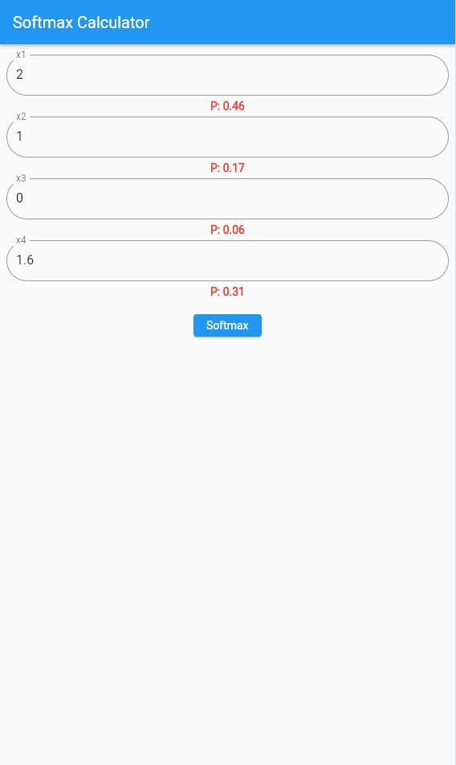

# Flutter Softmax Calculator

An intuitive Flutter app for computing softmax probabilities from a set of input values. Designed for simplicity and ease of use with a clean interface.

## Features

- Enter values and calculate softmax probabilities instantly.
- Minimalist UI with rounded inputs and highlighted results.

## Quick Start

Clone the repo, run `flutter pub get`, and then `flutter run` to start the app on your device or emulator.

## Preview

